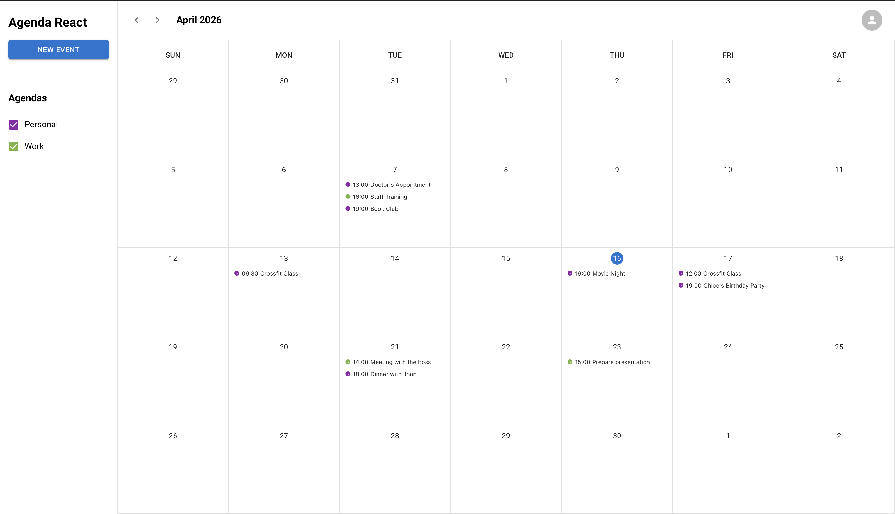

<a name="readme-top"></a>

<div align="center">

[![Contributors][contributors-shield]][contributors-url]
[![Forks][forks-shield]][forks-url]
[![Stargazers][stars-shield]][stars-url]
[![Issues][issues-shield]][issues-url]
[![LinkedIn][linkedin-shield]][linkedin-url]

<br />
<br />

  <a href="https://agenda-jsguilherme.netlify.app">
    
  </a>

  <p align="center">
    Agenda
    <br />
    <a href="https://agenda-jsguilherme.netlify.app">View Demo</a>
    ·
    <a href="https://github.com/SilveiraGuilherme/agenda/issues/new">Report Bug</a>
  </p>
</div>

## About the project

[](https://agenda-jsguilherme.netlify.app)

Agenda is a calendar web app where users can log in and manage events by date, time, description, and calendar.

Recent updates include:
- backend migration from Glitch to Render,
- Netlify API proxy for stable auth cookies,
- improved event form UX,
- responsive sidebar with mobile drawer,
- better calendar scrolling behavior and event ordering by time.

## Tech stack

- React + TypeScript
- Material UI
- Node.js + Express + json-server
- express-session + session-file-store
- Netlify (frontend)
- Render (backend)

## Project structure

- Frontend: root folder
- Backend: [agenda-react-backend](agenda-react-backend)

## Running locally

1. Clone the repository
   ```sh
   git clone https://github.com/SilveiraGuilherme/agenda.git
   cd agenda
   ```
2. Install frontend dependencies
   ```sh
   npm install
   ```
3. Install backend dependencies
   ```sh
   cd agenda-react-backend
   npm install
   ```
4. Start backend (port 8080)
   ```sh
   npm start -- --noauth
   ```
5. Start frontend (in a new terminal, from project root)
   ```sh
   npm start
   ```

## API base URL behavior

The frontend selects API base URL automatically:

- local development: `http://localhost:8080`
- production: `/api` (via Netlify rewrite/proxy)

Optional override:

- `REACT_APP_API_BASE_URL=https://your-backend-url`

## Deployment notes

- Frontend is deployed on Netlify.
- Backend is deployed on Render.
- In production, requests go through Netlify rewrite rules in [netlify.toml](netlify.toml) to keep auth/session behavior consistent across browsers.

## Features

- Month calendar view
- Event creation and editing
- Calendar filtering (show/hide calendars)
- Events sorted by time within each day
- Responsive layout (desktop sidebar + mobile drawer)
- Scrollable day cells for dense event lists

## Future improvements

If the project grows further, a more scalable structure would be a good next step:

- split UI into folders like `components`, `hooks`, `types`, `lib`, and `shared-ui`
- move shared interfaces and constants out of component files
- separate reusable logic from screen-specific code

The current structure is intentionally simpler. For the current scope it works well, but these changes would make it easier to maintain as the codebase grows.

## Contributing

Contributions are welcome.

1. Fork the repository
2. Create a feature branch (`git checkout -b feature/AmazingFeature`)
3. Commit your changes (`git commit -m 'Add some AmazingFeature'`)
4. Push to your branch (`git push origin feature/AmazingFeature`)
5. Open a pull request

## Author

[Guilherme Silveira](https://silveiraguilherme.github.io/SilveiraGuilherme/) |
[LinkedIn](https://linkedin.com/in/jsguilherme)

## Links

- Repository: [https://github.com/SilveiraGuilherme/agenda](https://github.com/SilveiraGuilherme/agenda)
- Live app: [https://agenda-jsguilherme.netlify.app](https://agenda-jsguilherme.netlify.app)

<p align="right">(<a href="#readme-top">back to top</a>)</p>

[contributors-shield]: https://img.shields.io/github/contributors/SilveiraGuilherme/agenda.svg?style=for-the-badge
[contributors-url]: https://github.com/SilveiraGuilherme/agenda/graphs/contributors
[forks-shield]: https://img.shields.io/github/forks/SilveiraGuilherme/agenda.svg?style=for-the-badge
[forks-url]: https://github.com/SilveiraGuilherme/agenda/network/members
[stars-shield]: https://img.shields.io/github/stars/SilveiraGuilherme/agenda.svg?style=for-the-badge
[stars-url]: https://github.com/SilveiraGuilherme/agenda/stargazers
[issues-shield]: https://img.shields.io/github/issues/SilveiraGuilherme/agenda.svg?style=for-the-badge
[issues-url]: https://github.com/SilveiraGuilherme/agenda/issues
[linkedin-shield]: https://img.shields.io/badge/-LinkedIn-black.svg?style=for-the-badge&logo=linkedin&colorB=555
[linkedin-url]: https://linkedin.com/in/jsguilherme
